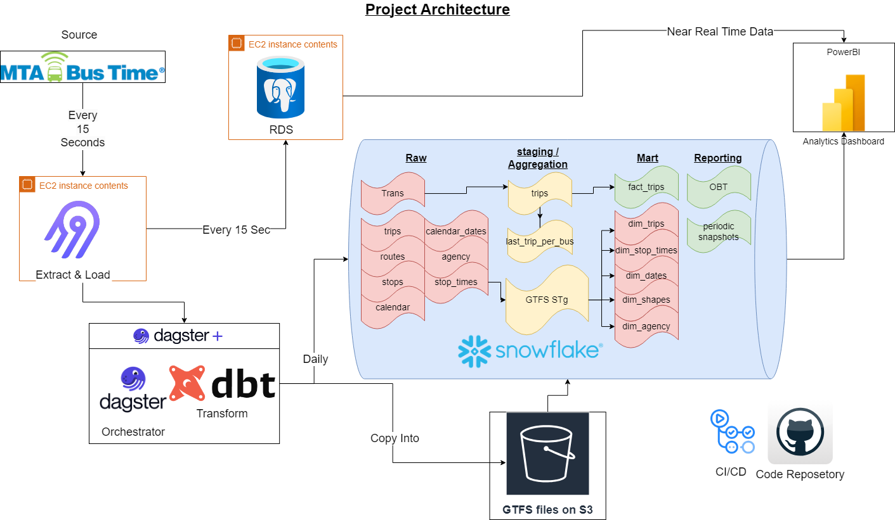
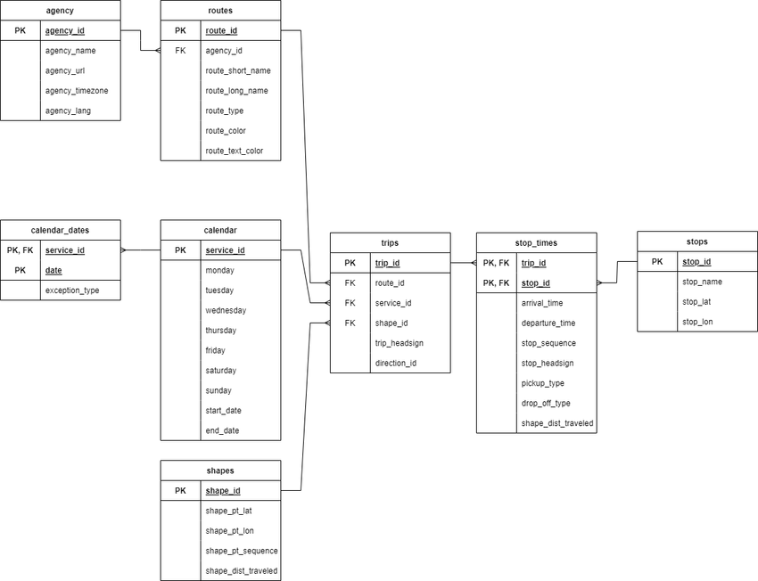
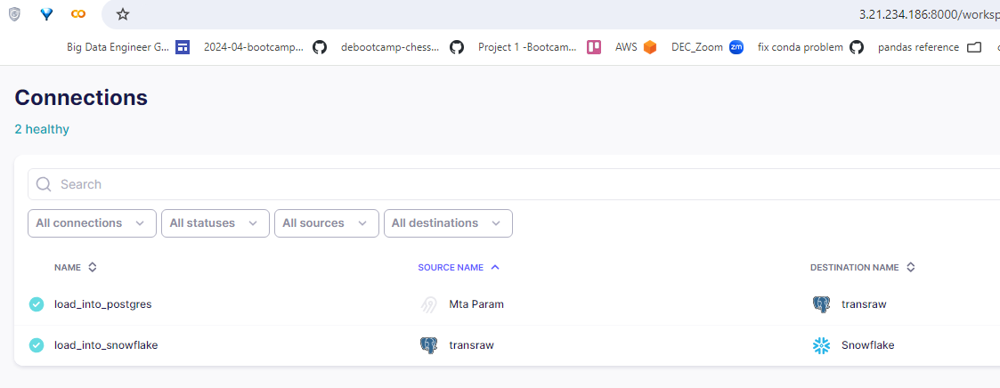
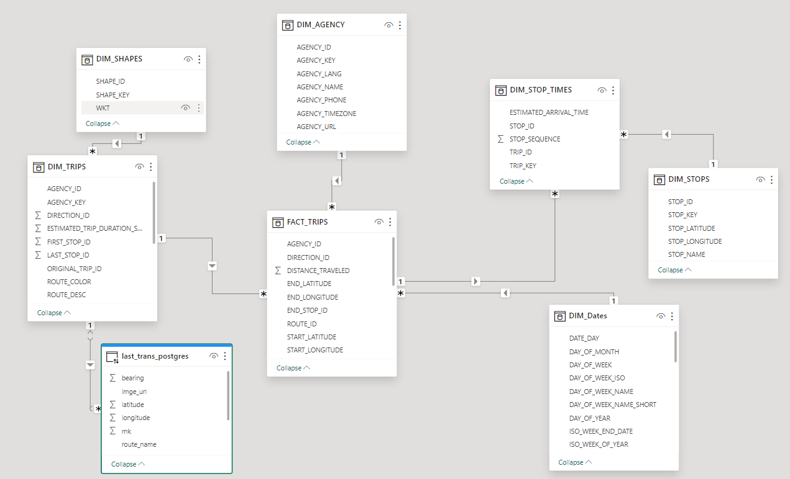
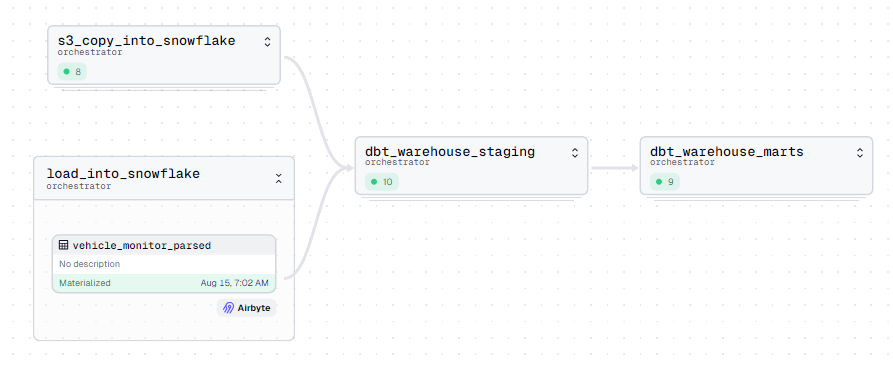
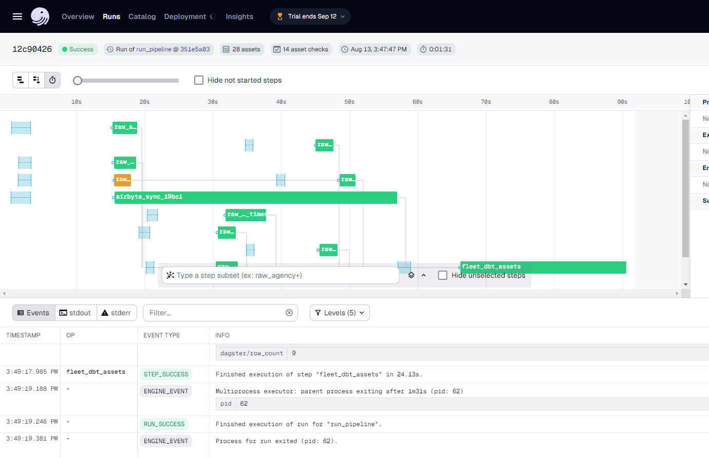
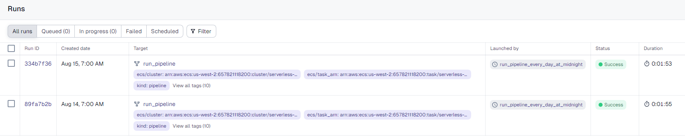
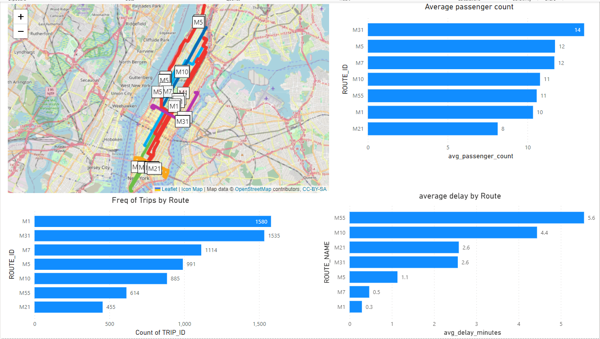
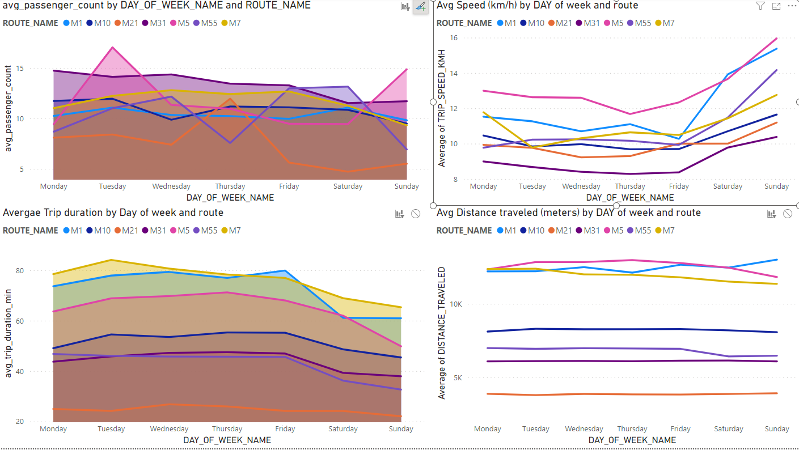
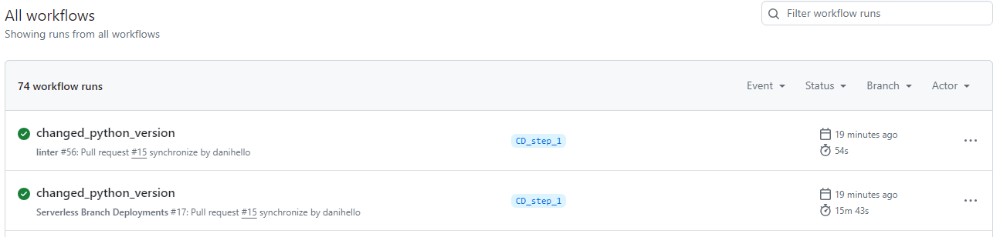

# NYCT-Manhattan-Bus Analysis Project 

* * *

 

## Table of Contents
- [Introduction](#introduction)
- [Solution Architecture](#solution-architecture)
- [Project Components](#project-components)
    - [Source](#source)
    - [Data Ingestion](#data-ingestion)
    - [Storage](#storage)
    - [Transformation](#transformation)
    - [Orchestration](#orchestration)
    - [Serving](#serving)
- [CI/CD](#cicd)
- [Notes on Security](#notes-on-security)

## Introduction

The objective of this project is to create a robust data pipeline that will enable the analysis of NYC MTA bus route performance. This will be achieved by simulating an IoT company that installs IoT devices on MTA buses to collect data.

The project involves mining data from these IoT devices and integrating it with static data from GTFS (General Transit Feed Specification) provided by the MTA, which includes information on agency, calendar, calendar_dates, routes, shapes, stop_times, and trips. The primary goal is to gather real-time bus location data from an API, which provides updates every 15 seconds. This data, combined with the GTFS data, will be used to construct detailed trip records.

Key objectives include:

1. **Data Collection**: Extract real-time bus location data and combine it with static GTFS data.

2. **Trip Creation**: Develop a method to create detailed trip records using the continuous data stream and GTFS data.

3. **Performance Analysis**: Analyze the gathered data to measure bus route crowding and identify routes with significant delays.

4. **Dashboard Visualization**: Implement a PowerBI dashboard to visualize analytics and provide actionable insights.

Questions we want to answer include:

- Which bus routes delay the most?
- Which bus routes are overcrowded?
- At what times routes are mostly delayed?
- At what times the routes are mostly overcrowded?
- Which bus routes have the best availability?

## Solution Architecture

**Figure 1**: Solution architecture

## Project Components

### Source
The source includes the MTA real Bus Time API, which provides real-time bus location data.
The API is documented [here](https://bt.mta.info/wiki/Developers/Index).

The second source is the MTA GTFS static data, which includes information on:
 -  Agency
 -  Calendar
 -  Calendar_dates
 -  Routes
 -  Shapes
 -  Stop_times
 -  Trips
 -  Stops

This data describes the scheduling of buses in New York City.

The GTFS entity relationship diagram is shown below.

**Figure 2**: GTFS Entity Relationship Diagram

More information about GTFS data sets can be found at:

[Google Transit](https://developers.google.com/transit/gtfs/reference)

[MTA Developer resources](https://new.mta.info/developers)

### Data Ingestion

We ingest the data from the MTA real Bus Time API using Airbyte.

Airbyte is hosted on an Amazon EC2 instance. It is responsible for data extraction and connection between the PostgreSQL database and the MTA real Bus Time API.
It runs every 15 seconds using a cron expression.

In order to connect to the API, a custom connector was created to pass an API key securely.

[MTA Custom Connector](./docs/yaml_files/mta_custom_connector.yaml)

**Figure 3**: Airbyte on cloud

We also use Airbyte to move the data from the PostgreSQL database to Snowflake warehouse daily using Dagster.

To load the GTFS files, we are hosting them on an S3 bucket and using Snowflake's COPY INTO method to ingest the data quickly and efficiently.

We have some large GTFS files; Stop_times has almost 1 million rows. Loading all the GTFS files using dbt seed would take more than 15 minutes. Loading it using COPY INTO takes less than 10 seconds.

**Figure 4**: Airbyte ingestion

### Storage

We use snowflake as the main storage for the project.
for several reasons:

1. **Scalability**: Snowflake's cloud-based architecture allows for easy scaling to handle large volumes of data from both the real-time bus location API and the GTFS static data.

2. **Performance**: Snowflake's columnar storage and MPP (Massively Parallel Processing) engine provide excellent query performance, which is crucial for analyzing the large datasets involved in this project.

3. **Data integration**: Snowflake makes it easy to integrate data from multiple sources, including the PostgreSQL database holding the raw transit data and the GTFS files stored in S3.

4. **Efficient data loading**: As mentioned in the ingestion data part, using Snowflake's COPY INTO method allows for quick and efficient loading of large GTFS files, significantly reducing ingestion time compared to other methods.

5. **Separation of storage and compute**: Snowflake's architecture allows you to scale storage and compute resources independently, optimizing costs and performance.

6. **Built-in features**: Snowflake provides features like time travel and data sharing, which can be valuable for data analysis and collaboration in this project.

7. **Integration with BI tools**: Snowflake integrates well with visualization tools like PowerBI, facilitating the creation of dashboards for route performance analysis.

We store the raw trans data on postgres hosted on AWS, there are several benefits we explore with this solution:

1. **Cost-effective buffer**: Loading data directly from Airbyte into Snowflake frequently (every 15 seconds) would be prohibitively expensive due to Snowflake's consumption-based pricing model. PostgreSQL serves as a cost-effective buffer for the raw transit data.

2. **Near real-time reporting**: The raw transit data stored in PostgreSQL can be used to generate near real-time location reports. This allows for immediate insights into bus locations without incurring the costs associated with frequent Snowflake queries.

3. **Data staging**: PostgreSQL acts as an excellent staging area for the raw transit data before it's transferred to Snowflake. This staging step allows for initial data quality checks and potential preprocessing.

4. **Flexible querying**: PostgreSQL's powerful querying capabilities enable quick analysis of the most recent data without impacting the main data warehouse operations in Snowflake.

5. **Reduced Snowflake ingestion frequency**: By using PostgreSQL, we can aggregate data over time and perform less frequent, batch transfers to Snowflake (e.g., daily), significantly reducing data ingestion costs.

### Transformation and Data Modeling
The data loaded from Airbyte and S3 into Snowflake forms the raw schema. This data is then read and undergoes various transformations before forming the staging schema:
- Field rename
- Data type casting
- case statements
- concatenation
- date formatting

Converting trans data into trips

The process of converting the trans data into trips involves several key steps:

1. **Data aggregation**: The raw transit data from trans.sql is aggregated to create meaningful trip records. This likely involves grouping the data by vehicle, route, and time periods to identify distinct trips.

2. **Enrichment with GTFS data**: The aggregated transit data is combined with static GTFS data (routes, stops, schedules) to add context and additional information to each trip.

3. **Trip identification**: Algorithms are applied to determine the start and end of each trip, possibly using factors like time thresholds, route changes, or specific stop patterns.

4. **Calculation of metrics**: Various performance metrics are calculated for each trip, such as actual travel time, scheduled travel time, delays, and potentially crowding information.

5. **Data cleaning and validation**: The process includes steps to clean the data, handle anomalies, and ensure the quality and consistency of the trip records.

6 **Incremental approach**: Post creation of trips a post hook is triggered to create a table with the latest trip date per each vehicle. Ensuring the next run would continute per each vehicle from the latest trans data available. Meaning even if a bus havent sent new data for days the incremental process would try to continue searching for new data.

This transformation process takes the granular, real-time data and converts it into a higher-level, trip-based format, that's more suitable for route performance analysis and reporting.

Before the data is loaded into the staging schema, data quality checks were performed using Great Expectations and dbt tests, ensuring that:
- Primary keys and foreign keys are not null
- Referential integrity between related tables
- Accepted value tests, confirming that certain columns only contain predefined acceptable values
- validating relationships between different models

Lastly, the marts schema is created performing additional transformations such as `joins`, `aggregations`,`calculations`, and `surrogate keys`.

The marts schema can be represented by the following Entity Relationship Diagram (ERD):

**Figure 5**: Marts - Entity Relationship Diagram (ERD)

### Orchestration
Dagster was the orchestration tool used in this project and it was deployed using [Dagster Cloud](https://dagster.io/cloud). Unlike other orchestration tools such as Airflow and Prefect, Dagster introduces an asset-based orchestration approach.

As with many Data Engineering projects, there are many ways to orchestrate the data pipeline. More specifically, 3 different approaches were considered:

1. Dagster Asset Job: Create an Airbyte asset and a Databricks custom asset. These two assets would be selected to form an asset job that would be scheduled to run by Dagster
2. Dagster Auto-materialize assets: Create an Airbyte asset and a Databricks custom asset. Define and attach auto-materialize policies on these assets. Dagster will automatically materialize these assets when the specified criteria are met

In this project, we use asset job to materialize the assets rather then Auto-materialize policy. We did it because it is a more flexible approach, allowing us to customize the execution logic and implement complex transformations steps that my not be possible with auto materialize.

In this approach, Dagster is responsible for calling the Airbyte connection along with Snowflake COPY INTO and then the dbt workflow illustrated below.

The Dagster Global Asset Lineage looks as follow:

**Figure 6**: Dagster Global Asset Lineage

Asset job run on the cloud:

**Figure 7**: Dagster asset job

Scheduled runs:

**Figure 8**: Dagster asset job scheduled runs

### Serving
A Power BI Dashboard was created to help answer the questions described in the [Introduction](#introduction) section. The Dashboard includes 4 tabs:
1. statistics: focusing on key performance indicators such as frequency, crowdedness, and average delay. This in-depth analysis provides valuable insights into route efficiency and passenger experience.
2. time trend: focusing on crowdedness, avergae delay, distance and speed per route and per day of the week.
3. tabular data: provides information about the live trips in a tabular form for easy extraction for ad-hoc analysis
4. live locations: shows bus locations at near real time data using information from the postgres raw trans data

**Figure 9**: Power BI Dashboard - Statistics

**Figure 10**: Power BI Dashboard - Time Trend

Dashboard is currently available online except for real time data, which is not available due to the limitation of the free version of Power BI.

[Dashboard](https://app.powerbi.com/view?r=eyJrIjoiNzkxMDQ0MzItNjE4Mi00ZDFhLWE4MWEtMmI3ODdlMjM0NmYxIiwidCI6IjcxYzViZWNkLWVkMWEtNDBiNy05NjdkLWE1NmQwZDYzY2QyNiIsImMiOjl9)

## CI/CD
GitHub Actions is used to trigger CI/CD pipeline:
- Linter workflow using black abd sqlfluff is responsible for flagging improperly formatted SQL and Python code
- Serveless branch deployment is responsible for creating staging environments of the Dagster code, right in Dagster Cloud. For every push to a branch in the git repository, Dagster Cloud will create a unique deployment, allowing you to preview the changes in the branch in real-time. For more information, visit the [docs](https://docs.dagster.io/dagster-cloud/managing-deployments/branch-deployments)
- Serveless prod deployment is responsible for deploying to Dagster cloud. Pushing to the main branch will deploy to prod Serverless deployment

**Figure 11**: Example of CI/CD workflow runs

## Instructions / Getting started

### infrastructure

This project uses AWS as the cloud provider, it dosent mean it has to be used, but it is the most convenient way to deploy the infrastructure.

The infrustracture includes:

1. RDS with postgres as the database

2. EC2 instance with Airbyte installed

3. Creting Snowflake account [get started with snowfalke](https://docs.snowflake.com/en/user-guide-getting-started)

4. Creating Dagster Cloud account [sign in for free](https://docs.snowflake.com/en/user-guide-getting-started)

A terraform script is provided with variables to customise the RDS and EC2 seperatly.
The scripts are defined in the [insfrastructure](/insfrastructure/) folder.

### Setting up Airbyte

1. follow the instructions in the [Airbyte docs](https://docs.airbyte.com/deploying-airbyte/on-aws-ec2) to install Airbyte on your EC2 instance. Use the instruction provided in the [insfrastructure](/insfrastructure/) folder for faster deployment.

2. Create a connection to your postgres database. 

3. Create a connection to your Snowflake account.

4. Create a custom connector to the MTA real data API,available at the [yaml files](/docs/yaml_files/) folder

creating connections in airbyte includes setting ap source, destination and a connection.
Use instructions provided at [Airbyte docs quickstart move data](https://docs.airbyte.com/using-airbyte/getting-started/oss-quickstart#3-move-data)

### Get GTFS data

1. Download the [GTFS static files](https://new.mta.info/developers), in this project we use manhattan but it is possible to use other areas as well.

2. Create an S3 bucket and upload the GTFS files on the bucket.

3. Make sure you have a connection to your S3 bucket. Please note an `S3_URL` environment variable is available to point to the location of you files on S3 bucket.

4. It is highly recommended to test the queries to COPY INTO snowflake. located at [snowflake asset](/orchestrator/assets/snowflake/snowflake.py) file.

### Test the pipeline

Assuming you get api data and GTFS data into snowflake you can test the dbt project located at the [dbt](/dbt/warehouse/) folder. Try running the project using `dbt build` command. more information about running dbt projects can be found [here](https://docs.getdbt.com/docs/running-a-dbt-project/run-your-dbt-projects)

### Deploy the pipeline

Once you are satisfied with the results of the test you can deploy the pipeline to Dagster Cloud.

More information about serverless deployement can be found [here](https://docs.dagster.io/dagster-plus/deployment/serverless)

## Notes on Security
1. When setting up your EC2 instance, be sure to configure your VPC security group to:
    - Expose only the necessary ports. Typically this is port `22` (for SSH), `443` (for HTTPS), and `8000` and `8001` for Airbyte
    - Whistelist only IPs that need to interact with your EC2 instance. This usually means your IP address and Dagster cloud IPs (if you use it as an orchestrator). You can check Dagster cloud IP addresses [here](https://docs.dagster.io/dagster-cloud/deployment/serverless#whitelisting-dagsters-ip-addresses)
2. When setting up your RDS instance, be sure to configure your VPC security group to:
    - Whitelist only IPs that need to interact with your RDS instance. This usually means your IP address and EC2 instance (so that Airbyte can interact with your RDS instance). You can allow your EC2 instance to connect to your RDS instance by adding the EC2 security group as a source in the RDS security group inbound rules# debootcamp-busfleet